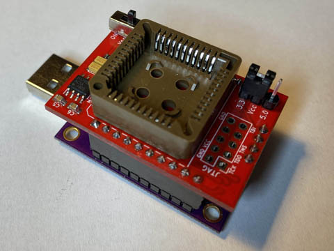

# ATF1504-FT232HQ Shield

This is a "hat" PCB that plugs onto an easily available FT232H board and provides a JTAG interface to ATF1504 CPLDs. It allows those ICs to be programmed and even to be reset when their JTAG interface has been disabled. There is also no warranty whatsoever. **USE AT YOUR OWN RISK!**.

See my [blog post](https://www.hackup.net/2020/01/erasing-and-programming-the-atf1504-cpld/) for more details.

## License

This work is licensed under a
[Creative Commons Attribution-NonCommercial-ShareAlike 4.0 International License](http://creativecommons.org/licenses/by-nc-sa/4.0/).
